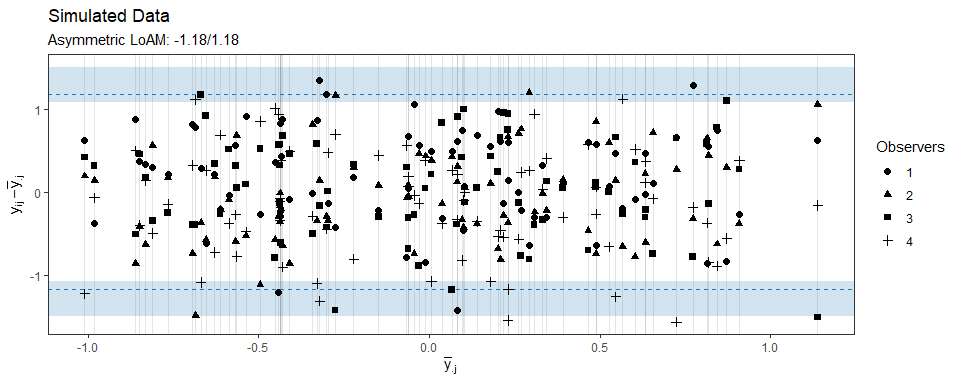

<!-- README.md is generated from README.Rmd. Please edit that file -->

# loamr

loamr is an R package to calculate and plot the estimate and CI for the
limits of agreement with the mean proposed by Christensen et al. 

## Installation

loamr may be installed using the following command

``` r
devtools::install_github("HaemAalborg/loamr")
```

# Overview

The package includes some data from Jones, this is in wide format, so we
transform this to a long format as the ‘LOAM’ function uses:

``` r
library(loamr)
data(Jones)
head(Jones)
#> # A tibble: 6 x 5
#>      X1    X2    X3    X4    X5
#>   <dbl> <dbl> <dbl> <dbl> <dbl>
#> 1   3.5   3.3   3.8   3.8   4  
#> 2   3.8   3.8   3.8   3.9   3.9
#> 3   2.2   2     2.8   2.4   2.1
#> 4   1.5   1.2   2.2   2.3   2  
#> 5   3.8   4     4.8   3.7   4.2
#> 6   3.5   3.3   4.8   3.6   3.9

Jones <- Jones %>%
  mutate(subject = 1:nrow(.)) %>%
  gather(observer, value, -subject)
```

Ww can calculate the Limit of Agreements and confidence intervals

``` r
LOAM(Jones)
#> Limits of agreement with the mean for multiple observers
#> 
#> The data has 200 observations from 40 individuals by 5 observers with 1 measurements
#> 
#> LoAM: +/-      1.131
#> Symmetric CI:        (0.935, 1.327)
#> Asymmetric CI:       (1.010, 1.816)
#> 
#> ICC:           0.837 (0.744, 0.903)
#> sigmaB:        0.285 (0.067, 0.503)
#> sigmaE:        0.579
#> 
#> Confidence interval in brackets: 95 %
```

The S3 class includes a generic plotting function made with ggplot2

``` r
grid.arrange(plot(LOAM(Jones), CItype="sym"), plot(LOAM(Jones), CItype="asym"), nrow=1)
```

<!-- -->

## Simulation of Data

The package also includes a function to simulate data (which is already
in long format)

``` r
sim <- simMD(subjects=80, observers=10)
LOAM(sim)
#> Limits of agreement with the mean for multiple observers
#> 
#> The data has 800 observations from 80 individuals by 10 observers with 1 measurements
#> 
#> LoAM: +/-      1.438
#> Symmetric CI:        (1.342, 1.534)
#> Asymmetric CI:       (1.363, 1.616)
#> 
#> ICC:           0.104 (0.057, 0.170)
#> sigmaB:        0.235 (0.113, 0.357)
#> sigmaE:        0.737
#> 
#> Confidence interval in brackets: 95 %
```

We can plot this, and as the plotting is done by ggplot2 it’s easy to
change elements of the plot, like the title:

``` r
plot(LOAM(sim), CItype="asym") + labs(title="Simulated Data")
#> Observers not illustrated as there is more than 6
```

<!-- -->

## References

1.  Jones’
2.  Borgbjerg’s
