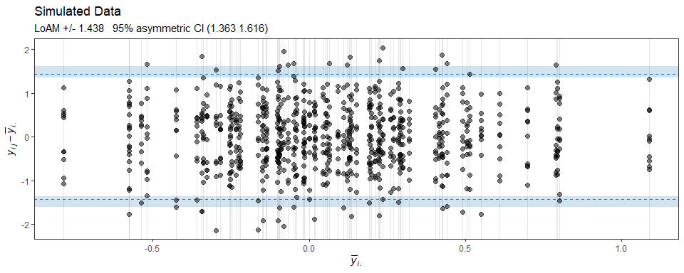

<!-- README.md is generated from README.Rmd. Please edit that file -->

# loamr

loamr is an R package for performing an agreement analysis for
continuous measurements by multiple observers as suggested by
Christensen et al. Specifically, the package can be used for making
agreement plots and calculation of the estimate and CI for the limits of
agreement with the mean proposed by Christensen et al. 

## Installation

loamr may be installed using the following command

``` r
devtools::install_github("HaemAalborg/loamr")
```

# Overview

## Simulation of Data

The package includes a function to simulate data from the two-way random
effects model:

``` r
sim <- simMD(subjects=80, observers=10)
LOAM(sim)
#> Limits of agreement with the mean for multiple observers
#> 
#> The data has 800 observations from 80 individuals by 10 observers with 1 measurements
#> 
#> LoAM: +/-      1.438
#> Symmetric CI:        (1.342, 1.534)
#> Asymmetric CI:       (1.363, 1.616)
#> 
#> ICC:           0.104 (0.057, 0.170)
#> sigmaB:        0.235 (0.113, 0.357)
#> sigmaE:        0.737 (0.698, 0.775)
#> 
#> Confidence interval in brackets: 95 %
```

The S3 class includes a generic plotting function made with ggplot2. As
the plotting is done by ggplot2 it’s easy to change elements of the
plot, like the title:

``` r
plot(LOAM(sim), CItype="asym") + labs(title="Simulated Data")
#> Observers not illustrated as there is more than 6
```

<!-- -->

## References

1.  Christensen et al.
