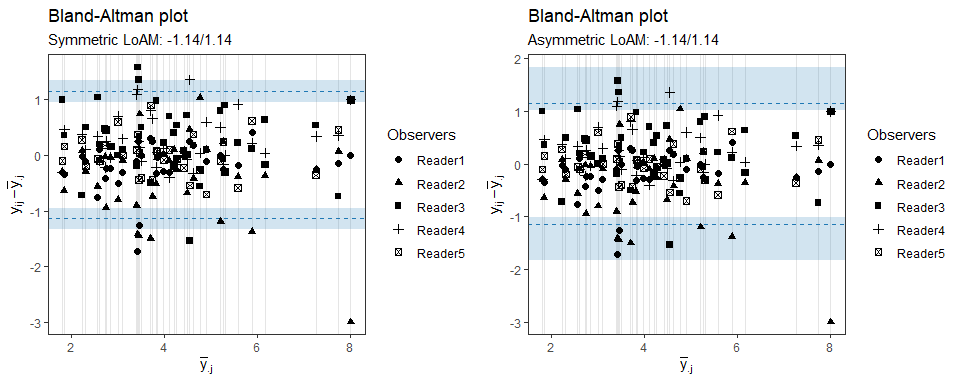
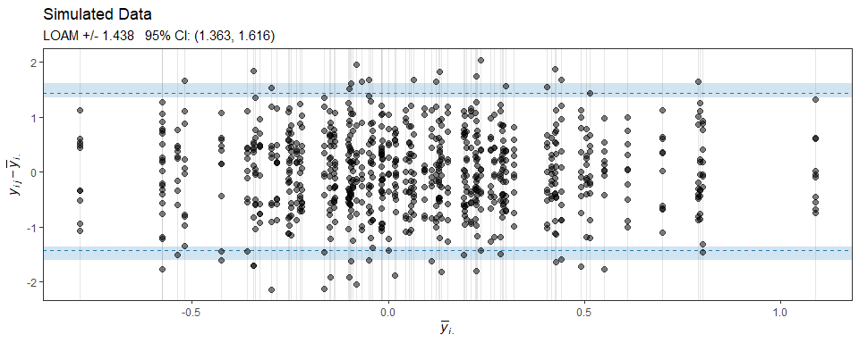

<!-- README.md is generated from README.Rmd. Please edit that file -->

# loamr: limits of agreement with the mean

`loamr` is an `R` package for performing agreement analysis on
continuous measurements made by multiple observers on a number of
subjects. The package provides functions for making agreement plots and
for calculating the estimate and CI for the limits of agreement with the
mean proposed by Christensen et al. (2020).

## Installation

`loamr` can be installed using the following command:

``` r
devtools::install_github("HaemAalborg/loamr")
```

## Example

The package includes a function to simulate data from the two-way random
effects model described in Christensen et al (2020):

``` r
sim <- simMD(subjects=80, observers=10)
head(sim)
#> # A tibble: 6 x 3
#>   subject observer   value
#>     <int>    <int>   <dbl>
#> 1       1        1 -0.0144
#> 2       1        2 -0.489 
#> 3       1        3  1.52  
#> 4       1        4  0.972 
#> 5       1        5 -0.531 
#> 6       1        6 -0.797
```

Estimate and CI for the limits of agreements with the mean:

``` r
LOAM(sim)
#> Limits of agreement with the mean for multiple observers
#> 
#> The data has 800 observations from 80 individuals by 10 observers with 1 measurements
#> 
#> LOAM:  +/- 1.438 (1.363, 1.616)
#> 
#> sigmaA:    0.264 (0.190, 0.337)
#> sigmaB:    0.235 (0.113, 0.357)
#> sigmaE:    0.737 (0.700, 0.777)
#> ICC(A,1):  0.104 (0.057, 0.170)
#> 
#> Coverage probability for the above CIs: 95%
```

The S3 class includes a generic plotting function made with `ggplot2`
for making an agreement plot with indication of estimate and CI for the
limits of agreement with the mean:

``` r
plot(LOAM(sim))
```

<!-- -->

Elements of the plot can be easily changed, e.g. the title:

``` r
plot(LOAM(sim)) + labs(title="Simulated Data")
```

<!-- -->

## References

1.  Christensen, H. S., Borgbjerg, J., Børty, L., and Bøgsted, M. (2020)
    “On Jones et al.’s method for extending Bland-Altman plots to limits
    of agreement with the mean for multiple observers”. BMC Medical
    Research Methodology. <https://doi.org/10.1186/s12874-020-01182-w>
