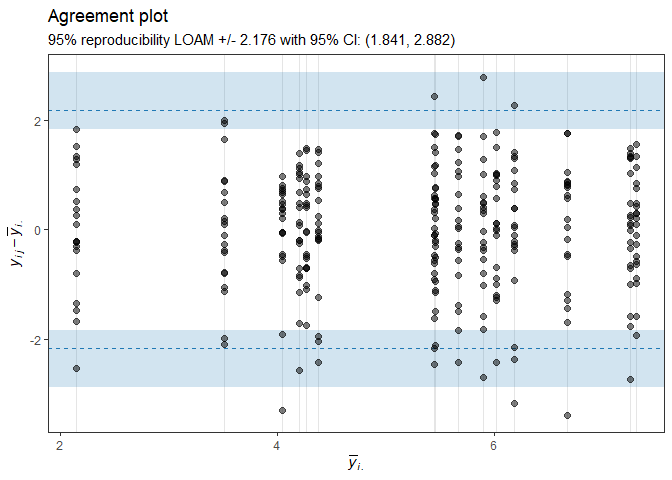
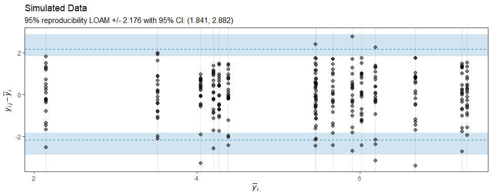

<!-- README.md is generated from README.Rmd. Please edit that file -->

# loamr: limits of agreement with the mean

loamr`is an`R\` package for performing agreement analysis on continuous
measurements made by multiple observers. The package provides functions
for

- making agreement plots and calculating the estimate and CI for the
  limits of agreement with the mean (LOAM) proposed by Christensen et
  al. (2020),
- the extension in Christensen et al. (2025) to repeated measurements,
  which allows a *repeatability* LOAM to be calculated in addition to
  the *reproducibility* LOAM, and optionally includes a subject-observer
  interaction in the model, and
- comparing the LOAMs obtained from two measurement methods applied to
  the same subjects and observers, using a parametric bootstrap.

## Installation

`loamr` can be installed using the following command:

``` r
devtools::install_github("CLINDA-AAU/loamr")
```

## Example: one measurement per subject and observer

The package includes a function to simulate data from the two-way random
effects model described in Christensen et al. (2020), as well as from
the extended model with a subject-observer interaction term described in
Christensen et al. (2025):

``` r
sim <- simMD(mu = 5)
head(sim)
#> # A tibble: 6 × 3
#>   subject observer value
#>     <int>    <int> <dbl>
#> 1       1        1  3.78
#> 2       1        2  3.82
#> 3       1        3  5.02
#> 4       1        4  5.71
#> 5       1        5  5.25
#> 6       1        6  4.92
```

Estimate and CI for the limits of agreements with the mean:

``` r
LOAM(sim)
#> Limits of agreement with the mean for multiple observers
#> 
#> The data has 300 observations from 15 individuals by 20 observers with 1 repeated measurements
#> 
#> 95% reproducibility LOAM:  +/- 2.176 (1.841, 2.882)
#> 
#> sigmaA:    1.441 (0.902, 1.981)
#> sigmaB:    0.910 (0.610, 1.211)
#> sigmaE:    0.685 (0.631, 0.748)
#> ICC(A,1):  0.616 (0.420, 0.811)
#> 
#> Coverage probability for the above CIs: 95%
```

The S3 class includes a generic plotting function made with `ggplot2`
for making an agreement plot with indication of estimate and CI for the
limits of agreement with the mean:

``` r
plot(LOAM(sim))
```

<!-- -->

Elements of the plot is easily changed using functionalities from
`ggplot2`. For example, changing the title:

``` r
plot(LOAM(sim)) + ggplot2::labs(title = "Simulated Data")
```

<!-- -->

## Example: repeated measurements and interaction

The **reproducibility LOAM** can always be calculated, also when there
is only one measurement per subject and observer. When each observer
measures each subject more than once, a **repeatability LOAM** can be
calculated as well (Christensen et al. 2025):

- The **reproducibility LOAM** reflects all sources of variation between
  measurements on the same subject: differences between observers (and,
  if included, the subject-observer interaction) as well as variation
  between repeated measurements.
- The **repeatability LOAM** only reflects variation between repeated
  measurements by the *same* observer on the same subject.

``` r
sim_rep <- simMD(mu = 5, sigma2AB = 0.3, interaction = TRUE,
                 n_subjects = 20, n_observers = 8, n_measurements = 3)
head(sim_rep)
#> # A tibble: 6 × 4
#>   subject observer measurement value
#>     <int>    <int>       <int> <dbl>
#> 1       1        1           1  6.19
#> 2       1        1           2  6.37
#> 3       1        1           3  6.92
#> 4       1        2           1  5.09
#> 5       1        2           2  5.02
#> 6       1        2           3  4.21
```

``` r
fit <- LOAM(sim_rep, interaction = TRUE)
fit$estimates
#> # A tibble: 1 × 6
#>   LOAM_reprod LOAM_repeat sigmaA sigmaB sigmaAB sigmaE
#>         <dbl>       <dbl>  <dbl>  <dbl>   <dbl>  <dbl>
#> 1        3.02        1.25   1.39   1.36   0.437  0.783
fit$intervals
#> # A tibble: 2 × 6
#>   reprod_CI repeat_CI sigmaA_CI sigmaB_CI sigmaAB_CI sigmaE_CI
#>       <dbl>     <dbl>     <dbl>     <dbl>      <dbl>     <dbl>
#> 1      2.36      1.16     0.940     0.640      0.322     0.727
#> 2      5.37      1.36     1.85      2.08       0.551     0.849
```

Once there is more than one measurement per subject-observer
combination, both LOAMs are reported. With a single measurement per
combination, only the reproducibility LOAM is available.

## Example: comparing two measurement methods

`LOAM_diff_boot()` compares the LOAMs from two methods (for example CT
and MRI) applied to the same subjects by the same observers, with the
same number of repeated measurements. It returns a confidence interval
for the difference between the two LOAMs and a p-value for testing that
they are equal, for reproducibility and, when there are repeated
measurements, also for repeatability. Since the two LOAM estimates are
dependent, a parametric bootstrap based on a bivariate two-way random
effects model is used.

`data1` and `data2` must be in the same long format as for `LOAM()`,
with the same subject/observer/measurement combinations. Here they are
simulated independently, so there is no correlation between the methods;
this is for illustration only.

``` r
method1 <- simMD(mu = 5, sigma2B = 1,   n_subjects = 20, n_observers = 8, n_measurements = 3)
method2 <- simMD(mu = 5, sigma2B = 2.5, n_subjects = 20, n_observers = 8, n_measurements = 3)

res <- LOAM_diff_boot(method1, method2, R = 500, seed = 1)
res
#> Reproducibility LOAM:
#>   LOAM1 = 2.0862, LOAM2 = 4.6910, diff = -2.6048
#>   95% CI for diff: (-4.9601, -0.7079)
#>   bootstrap p-value (H0: LOAM1 = LOAM2): 0.0000
#> 
#> Repeatability LOAM:
#>   LOAM1 = 1.1105, LOAM2 = 1.2124, diff = -0.1019
#>   95% CI for diff: (-0.2052, 0.0047)
#>   bootstrap p-value (H0: LOAM1 = LOAM2): 0.0760
```

The `interaction` argument works as for `LOAM()`, and one-sided tests
are available through `alternative = "less"` or
`alternative = "greater"`.

A larger `R` gives more stable results; `R = 500` is used here to keep
the example fast. The constructed confidence interval is a basic
bootstrap interval.

## References

1.  Christensen, H. S., Borgbjerg, J., Børty, L., and Bøgsted, M. (2020)
    “On Jones et al.’s method for extending Bland-Altman plots to limits
    of agreement with the mean for multiple observers”. BMC Medical
    Research Methodology. <https://doi.org/10.1186/s12874-020-01182-w>

2.  Christensen, H. S., Bøgsted, M., and Borgbjerg, J. (2025) “A
    statistical note on extending Christensen’s limits of agreement with
    the mean”. ArXiv (preprint).
    <https://doi.org/10.48550/arXiv.2508.16250>
