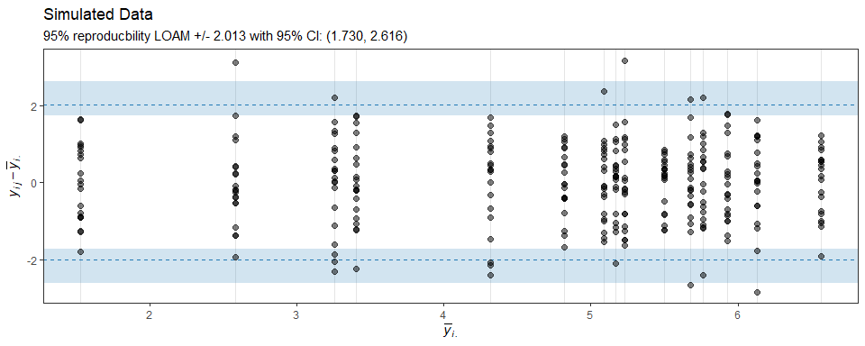

<!-- README.md is generated from README.Rmd. Please edit that file -->

# loamr: limits of agreement with the mean

`loamr` is an `R` package for performing agreement analysis on
continuous measurements made by multiple observers. The package provides
functions for making agreement plots and for calculating the estimate
and CI for the limits of agreement with the mean proposed by Christensen
et al. (2020).

## Installation

`loamr` can be installed using the following command:

``` r
devtools::install_github("CLINDA-AAU/loamr")
```

## Example

The package includes a function to simulate data from the two-way random
effects model described in Christensen et al. (2020):

``` r
sim <- simMD(mu = 5)
head(sim)
#> # A tibble: 6 × 3
#>   subject observer value
#>     <int>    <int> <dbl>
#> 1       1        1  4.93
#> 2       1        2  5.89
#> 3       1        3  6.69
#> 4       1        4  5.10
#> 5       1        5  7.70
#> 6       1        6  4.55
```

Estimate and CI for the limits of agreements with the mean:

``` r
LOAM(sim)
#> Limits of agreement with the mean for multiple observers
#> 
#> The data has 300 observations from 15 individuals by 20 observers with 1 repeated measurements
#> 
#> 95% reproducibility LOAM:  +/- 2.013 (1.730, 2.616)
#> 
#> sigmaA:    1.428 (0.893, 1.963)
#> sigmaB:    0.799 (0.533, 1.066)
#> sigmaE:    0.687 (0.633, 0.751)
#> ICC(A,1):  0.647 (0.459, 0.830)
#> 
#> Coverage probability for the above CIs: 95%
```

The S3 class includes a generic plotting function made with `ggplot2`
for making an agreement plot with indication of estimate and CI for the
limits of agreement with the mean:

``` r
plot(LOAM(sim))
```

<!-- -->

Elements of the plot is easily changed using functionalities from
`ggplot2`. For example, changing the title:

``` r
plot(LOAM(sim)) + ggplot2::labs(title = "Simulated Data")
```

<!-- -->

## References

1.  Christensen, H. S., Borgbjerg, J., Børty, L., and Bøgsted, M. (2020)
    “On Jones et al.’s method for extending Bland-Altman plots to limits
    of agreement with the mean for multiple observers”. BMC Medical
    Research Methodology. <https://doi.org/10.1186/s12874-020-01182-w>
