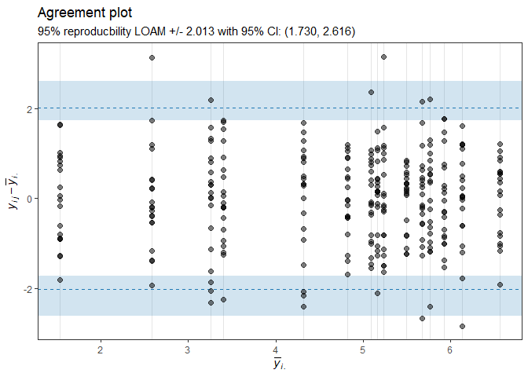

<!-- README.md is generated from README.Rmd. Please edit that file -->

# loamr

loamr is an R package to …

## Installation

loamr may be installed using the following command

``` r
devtools::install_github("HaemAalborg/loamr")
```

# Overview

The main function of loamr is..

``` r
library(loamr)
data(Jones)
head(Jones)
#>   X3.5 X3.3 X3.8 X3.8.1  X4
#> 1  3.8  3.8  3.8    3.9 3.9
#> 2  2.2  2.0  2.8    2.4 2.1
#> 3  1.5  1.2  2.2    2.3 2.0
#> 4  3.8  4.0  4.8    3.7 4.2
#> 5  3.5  3.3  4.8    3.6 3.9
#> 6  4.2  4.0  4.8    4.1 4.2
```

``` r
la <- LOAM(Jones)
la
#> Output of this type of function... somthing
#> 
#> The data has 195 measurements from 39 individuals by 5 readers
#> 
#> Jones' LoAM
#> [1] -1.14755  1.14755
#> 
#> Borgbjerg's LoAM
#> [1] -1.142867  1.142867
#> 
#> Standard Error: 0.34
#> Maybe some text here also...
```

``` r
plot(la)
```

<!-- -->

## References

1.  Jones’
2.  Borgbjerg’s
